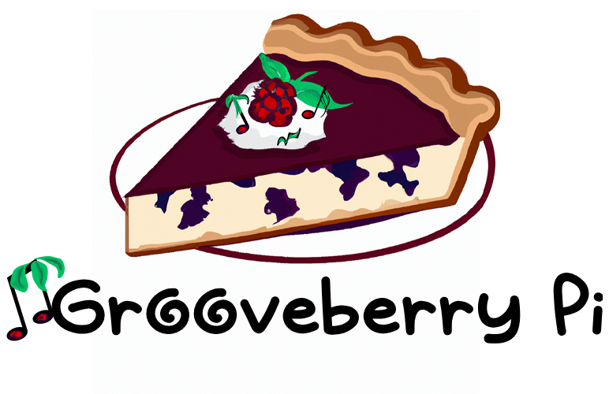

# Grooveberry Pi: A Flavor-Packed Symphony 🎶🍓

Welcome to **Grooveberry Pi**, where the enchanting realm of sound collides with the vibrant world of orchards. Dive into a unique musical experience, blending the lofi universe with the tantalizing tastes of fruits. Every note you hear is a fruit – be it sweet, sour, tangy, or anything in between. Here, you're not just a listener; you're a chef, crafting your very own fruit salad of lofi beats.

<p align="center">
  
</p>


## Overview 🌐

**Grooveberry Pi** is a groundbreaking platform designed to leverage the power of the Raspberry Pi, allowing users to mix and match a variety of lofi "flavors". Imagine having an entire orchard at your fingertips, where each fruit represents a distinct lofi note. The goal? To blend these musical fruits into a harmonious fruit salad, bursting with FX, beats, chords, melodies, and so much more.

## Tech Stack: A Deep Dive 🛠

### Backend: NGINX + Flask (Python) 🐍

**NGINX**:
- **Role**: NGINX serves as both a high-performance HTTP server and a reverse proxy. It handles incoming client requests, efficiently distributing them to our Flask application, ensuring faster content delivery, which is crucial for real-time sound synthesis and playback.
- **Configuration**: We utilize NGINX's powerful configuration capabilities to optimize performance. This includes setting up gzip compression, SSL termination, and static content caching.
- **Integration with Flask**: NGINX communicates with Flask using the WSGI (Web Server Gateway Interface) protocol. We use `uWSGI` as the application server to bridge the gap between NGINX and Flask.

**Flask (Python)**:
- **Role**: Flask processes client requests, interacts with the synthesizer logic, and sends back audio responses, ensuring users get the desired synth sounds.
- **Design**: Flask's modular design allows us to create endpoints for functionalities like "Pick Fruit", "Cut Fruit", and "Blend Fruit", directly influencing the sound synthesis process.
- **Database**: SQLAlchemy stores user profiles, fruit sound samples, and custom blends, ensuring users can save and retrieve their unique synth creations.
- **Extensions**: Flask extensions like Flask-Login and Flask-WTF enhance user experience by handling authentication and form submissions, respectively.

### Frontend: React (JavaScript) ⚛️

**React**:
- **Role**: React builds the user interface, providing users with visual tools to craft their synth sounds.
- **Component-Based Architecture**: Each part of the Grooveberry Pi interface is a reusable React component, ensuring a consistent and intuitive sound crafting experience.
- **State Management**: The Context API and React hooks track data like selected fruits and user-created blends, influencing the sound output in real-time.
- **Integration with Flask**: React communicates with Flask using AJAX requests via Axios, fetching data and updating the frontend, ensuring immediate auditory feedback.
- **Styling**: Styled-components ensure a visually appealing interface, making the sound crafting process enjoyable and intuitive.

### Communication Between Backend and Frontend 🔄

- **API Endpoints**: Flask's API endpoints allow React to fetch available fruit sounds, save user blends, and process sound modifications, ensuring users can craft, modify, and playback their synth sounds seamlessly.
- **JSON**: Data, like user-created blends, is exchanged in JSON format, ensuring a standardized communication format for sound data.
- **WebSockets**: For real-time functionalities, like live collaboration on a blend or real-time playback adjustments, we use WebSockets, ensuring instantaneous sound updates.

---

With this tech stack, **Grooveberry Pi** offers a seamless and immersive experience, merging the power of the Raspberry Pi with modern web technologies. Every interaction, from picking fruits to blending beats, is intricately tied to crafting unique synth sounds, making it more than just a musical platform; it's a sonic adventure. 🎶🍓🎉


## Getting Started 🚀

### Prep Bowl 🍲

This is your environment setup. We've made it easy for you:

1. **Download Grooveberry Pi**: Grab the latest release from our GitHub repository.
2. **Install**: Run the installer and follow the on-screen instructions. This will set up both the backend (NGINX + Flask) and frontend (React) for you.

### Pick Fruit 🍎

This is where you select your samples and instruments:

1. **Browse**: Navigate through our orchard of lofi notes, each represented by a unique fruit icon.
2. **Select**: Click on a fruit to listen to its sound and add it to your basket.

### Cut Fruit 🔪

Splice and dice your chosen sounds:

1. **Edit**: Use the cutting board interface to trim, adjust, and modify your selected fruit sounds.
2. **Preview**: Play the edited sound to ensure it's just right.

### Blend Fruit 🍹

Layer and mix your sounds:

1. **Layer**: Drag and drop your fruits onto the blending board.
2. **Adjust**: Tweak the pitch, volume, and FX to get the desired blend.
3. **Taste Test**: Play your blend and make any necessary adjustments.

## Example: The "fruit_salad" Synth Patch 🍎🎵

```json
{
  "base": "mellow_beat",
  "fruits": [
    {
      "type": "melody",
      "fruit": "apple",
      "pitch": "+2",
      "volume": "80%"
    },
    {
      "type": "chord",
      "fruit": "grape",
      "pitch": "-1",
      "volume": "70%"
    },
    {
      "type": "FX",
      "fruit": "kiwi",
      "effect": "reverb",
      "intensity": "medium"
    }
  ]
}
